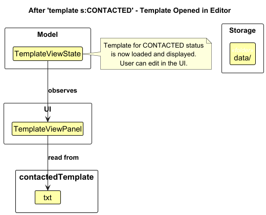
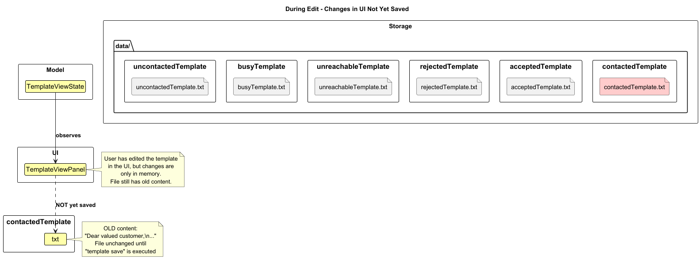
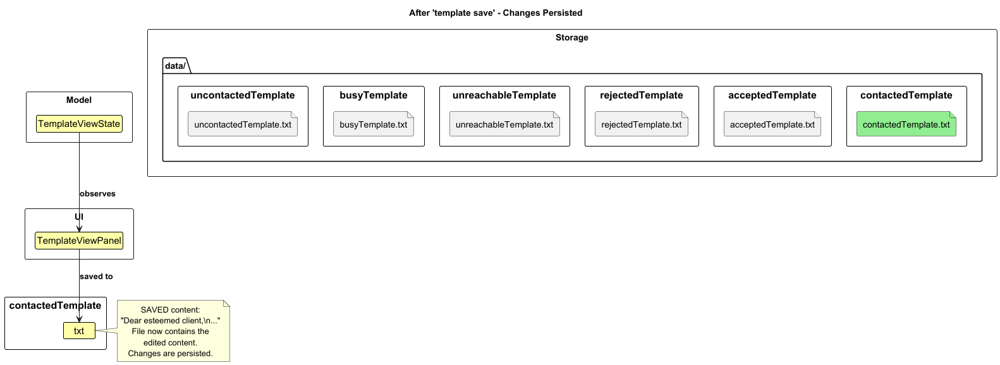
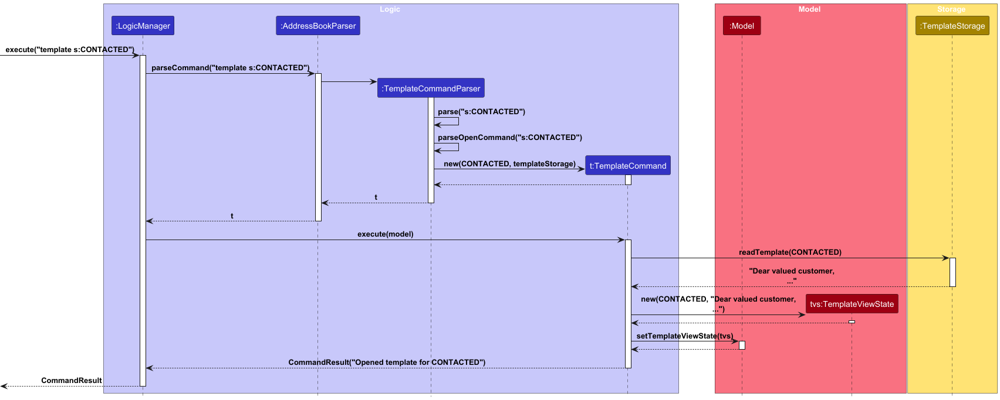
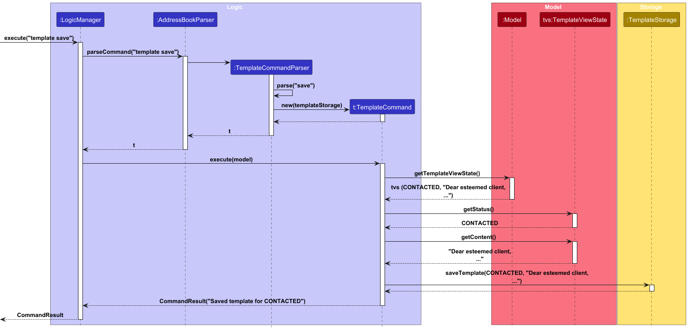

* Table of Contents
{:toc}

--------------------------------------------------------------------------------------------------------------------

## **Acknowledgements**

* {list here sources of all reused/adapted ideas, code, documentation, and third-party libraries -- include links to the original source as well}

--------------------------------------------------------------------------------------------------------------------

## **Setting up, getting started**

Refer to the guide [_Setting up and getting started_](SettingUp.md).

--------------------------------------------------------------------------------------------------------------------

## **Design**

:bulb: **Tip:** The `.puml` files used to create diagrams are in this document `docs/diagrams` folder. Refer to the [_PlantUML Tutorial_ at se-edu/guides](https://se-education.org/guides/tutorials/plantUml.html) to learn how to create and edit diagrams.

### Architecture

The ***Architecture Diagram*** given above explains the high-level design of the App.

Given below is a quick overview of main components and how they interact with each other.

**Main components of the architecture**

**`Main`** (consisting of classes [`Main`](https://github.com/AY2526S1-CS2103T-T08-2/tp/tree/master/src/main/java/seedu/address/Main.java) and [`MainApp`](https://github.com/AY2526S1-CS2103T-T08-2/tp/tree/master/src/main/java/seedu/address/MainApp.java)) is in charge of the app launch and shut down.
* At app launch, it initializes the other components in the correct sequence, and connects them up with each other.
* At shut down, it shuts down the other components and invokes cleanup methods where necessary.

The bulk of the app's work is done by the following four components:

* [**`UI`**](#ui-component): The UI of the App.
* [**`Logic`**](#logic-component): The command executor.
* [**`Model`**](#model-component): Holds the data of the App in memory.
* [**`Storage`**](#storage-component): Reads data from, and writes data to, the hard disk.

[**`Commons`**](#common-classes) represents a collection of classes used by multiple other components.

**How the architecture components interact with each other**

The *Sequence Diagram* below shows how the components interact with each other for the scenario where the user issues the command `delete 1`.

Each of the four main components (also shown in the diagram above),

* defines its *API* in an `interface` with the same name as the Component.
* implements its functionality using a concrete `{Component Name}Manager` class (which follows the corresponding API `interface` mentioned in the previous point.

For example, the `Logic` component defines its API in the `Logic.java` interface and implements its functionality using the `LogicManager.java` class which follows the `Logic` interface. Other components interact with a given component through its interface rather than the concrete class (reason: to prevent outside component's being coupled to the implementation of a component), as illustrated in the (partial) class diagram below.

The sections below give more details of each component.

### UI component

The **API** of this component is specified in [`Ui.java`](https://github.com/AY2526S1-CS2103T-T08-2/tp/tree/master/src/main/java/seedu/address/ui/Ui.java)

The UI consists of a `MainWindow` that is made up of parts e.g.`CommandBox`, `ResultDisplay`, `PersonListPanel`, `StatusBarFooter` etc. All these, including the `MainWindow`, inherit from the abstract `UiPart` class which captures the commonalities between classes that represent parts of the visible GUI.

The `UI` component uses the JavaFx UI framework. The layout of these UI parts are defined in matching `.fxml` files that are in the `src/main/resources/view` folder. For example, the layout of the [`MainWindow`](https://github.com/AY2526S1-CS2103T-T08-2/tp/tree/master/src/main/java/seedu/address/ui/MainWindow.java) is specified in [`MainWindow.fxml`](https://github.com/AY2526S1-CS2103T-T08-2/tp/tree/master/src/main/resources/view/MainWindow.fxml)

The `UI` component,

* executes user commands using the `Logic` component.
* listens for changes to `Model` data so that the UI can be updated with the modified data.
* keeps a reference to the `Logic` component, because the `UI` relies on the `Logic` to execute commands.
* depends on some classes in the `Model` component, as it displays `Person` object residing in the `Model`.

### Logic component

**API** : [`Logic.java`](https://github.com/AY2526S1-CS2103T-T08-2/tp/tree/master/src/main/java/seedu/address/logic/Logic.java)

Here's a (partial) class diagram of the new `Logic` component, with additional classes to the AB3 being shown in light blue:

The sequence diagram below illustrates the interactions within the `Logic` component, taking `execute("delete 1")` API call as an example.

How the `Logic` component works:

1. When `Logic` is called upon to execute a command, it is passed to an `AddressBookParser` object which in turn creates a parser that matches the command (e.g., `DeleteCommandParser`) and uses it to parse the command.
1. This results in a `Command` object (more precisely, an object of one of its subclasses e.g., `DeleteCommand`) which is executed by the `LogicManager`.
1. The command can communicate with the `Model` when it is executed (e.g. to delete a person). 
   Note that although this is shown as a single step in the diagram above (for simplicity), in the code it can take several interactions (between the command object and the `Model`) to achieve.
1. The result of the command execution is encapsulated as a `CommandResult` object which is returned back from `Logic`.

Here are the other classes in `Logic` (omitted from the class diagram above) that are used for parsing a user command:

How the parsing works:
* When called upon to parse a user command, the `AddressBookParser` class creates an `XYZCommandParser` (`XYZ` is a placeholder for the specific command name e.g., `AddCommandParser`) which uses the other classes shown above to parse the user command and create a `XYZCommand` object (e.g., `AddCommand`) which the `AddressBookParser` returns back as a `Command` object.
* All `XYZCommandParser` classes (e.g., `AddCommandParser`, `DeleteCommandParser`, ...) inherit from the `Parser` interface so that they can be treated similarly where possible e.g, during testing.

### Model component
**API** : [`Model.java`](https://github.com/AY2526S1-CS2103T-T08-2/tp/tree/master/src/main/java/seedu/address/model/Model.java)

The `Model` component,

* stores the address book data i.e., all `Person` objects (which are contained in a `UniquePersonList` object).
* stores the currently 'selected' `Person` objects (e.g., results of a search query) as a separate _filtered_ list which is exposed to outsiders as an unmodifiable `ObservableList<Person>` that can be 'observed' e.g. the UI can be bound to this list so that the UI automatically updates when the data in the list change.
* stores a `UserPrefs` object that represents the user's preferences. This is exposed to the outside as `ReadOnlyUserPrefs` objects.
* stores view state objects (`StatusViewState`, `TagsViewState`, `TemplateViewState`) as observable properties that track the current UI filter and display states. These are exposed as `ReadOnlyObjectProperty` instances that the UI can observe for reactive updates.
* does not depend on any of the other three components (as the `Model` represents data entities of the domain, they should make sense on their own without depending on other components)

:information_source: **Note:** An alternative (arguably, a more OOP) model is given below. It has a `Tag` list in the `AddressBook`, which `Person` references. This allows `AddressBook` to only require one `Tag` object per unique tag, instead of each `Person` needing their own `Tag` objects. 

### Storage component

**API** : [`Storage.java`](https://github.com/AY2526S1-CS2103T-T08-2/tp/tree/master/src/main/java/seedu/address/storage/Storage.java)

The `Storage` component,
* can save both address book data and user preference data in JSON format, and read them back into corresponding objects.
* inherits from both `AddressBookStorage` and `UserPrefStorage`, which means it can be treated as either one (if only the functionality of only one is needed).
* depends on some classes in the `Model` component (because the `Storage` component's job is to save/retrieve objects that belong to the `Model`)

### Common classes

Classes used by multiple components are in the `seedu.address.commons` package.

--------------------------------------------------------------------------------------------------------------------

## **Implementation**

This section describes some noteworthy details on how certain features are implemented.

### Template feature

#### Implementation

The template feature allows salespersons to create, edit, and copy email templates associated with different contact statuses. This streamlines the process of sending personalized emails to contacts at different stages of the sales process.

The template mechanism is facilitated by `TemplateStorage`, `TemplateCommand`, and `TemplateViewState`. It uses the following key components:

* `TemplateStorage` — Interface for reading and writing template files.
* `TemplateStorageManager` — Concrete implementation that stores templates as text files in the data directory.
* `TemplateCommand` — Command that handles both opening templates for editing and saving edited templates.
* `TemplateViewState` — Model class that tracks the currently displayed template (status and content).
* `TemplateViewPanel` — UI component that displays the template editor.

These operations are exposed in the `Model` interface as:
* `Model#getTemplateViewStateProperty()` — Returns an observable property for the current template state.
* `Model#setTemplateViewState(TemplateViewState)` — Updates the template view state.

And in the `Storage` interface as:
* `Storage#readTemplate(Status)` — Reads a template for a specific status.
* `Storage#saveTemplate(Status, String)` — Saves template content for a specific status.

Given below is an example usage scenario and how the template mechanism behaves at each step.

Step 1. The salesperson launches the application. The `TemplateStorage` is initialized and ready to read/write template files in the data directory. No template is currently being viewed, so `TemplateViewState` is null.

Step 2. The salesperson executes `template s:CONTACTED` to open the template for contacted clients. The `TemplateCommand` calls `Storage#readTemplate(Status.CONTACTED)` to retrieve the template content (or default template if none exists), then calls `Model#setTemplateViewState(TemplateViewState)` to display it in the template editor.

Step 3. The salesperson edits the template content directly in the `TemplateViewPanel`. The changes are stored in the UI component but not yet saved to persistent storage. The model's `TemplateViewState` is updated when the salesperson types.

:information_source: **Note:** The template content is only saved to storage when the `template save` command is explicitly executed. Simply editing the text does not persist changes.

Step 4. The salesperson decides to save the edited template by executing `template save`. The `TemplateCommand` retrieves the current `TemplateViewState` from the model, extracts the status and content, and calls `Storage#saveTemplate(Status, String)` to persist the changes.

:information_source: **Note:** If the salesperson switches to a different view (e.g., executes `list` or `find`) without saving, the edited content is discarded and not persisted.

The following sequence diagram shows how the template open operation goes through the `Logic` component:

The following sequence diagram shows how the template save operation works:

Step 5. The salesperson can also copy a template directly to the clipboard without opening the editor by executing `copy s:CONTACTED`. This reads the template and places it on the system clipboard for pasting into an email client.

The following sequence diagram shows how the copy operation works:

The template feature supports all six contact statuses (UNCONTACTED, CONTACTED, REJECTED, ACCEPTED, UNREACHABLE, BUSY), with each status having its own independent template file.

#### Design considerations:

**Aspect: How templates are stored:**

* **Alternative 1 (current choice):** Store each template as a separate text file per status.
  * Pros: Simple to implement, easy to manually edit templates outside the application, human-readable format.
  * Cons: Requires file I/O for each template operation, potential for file system errors.

* **Alternative 2:** Store all templates in a single JSON file.
  * Pros: Single file to manage, consistent with address book storage format, easier to backup.
  * Cons: More complex serialization/deserialization, harder for users to manually edit, risk of corrupting all templates if JSON is malformed.

**Aspect: When to save template changes:**

* **Alternative 1 (current choice):** Require explicit `template save` command.
  * Pros: Gives users control over when changes are persisted, prevents accidental overwrites, clear user intent.
  * Cons: Users might forget to save and lose their edits.

* **Alternative 2:** Auto-save on every keystroke or after a delay.
  * Pros: No risk of losing work, more convenient for users.
  * Cons: May cause performance issues with frequent file I/O, harder to implement "cancel" functionality, could save incomplete/incorrect templates.

**Aspect: Template editor vs. clipboard copy:**

* **Current implementation:** Provides both `template s:STATUS` (opens editor) and `copy s:STATUS` (direct clipboard copy).
  * Pros: Flexibility for different workflows - edit for customization, copy for quick use.
  * Cons: Two different commands to learn and maintain.

* **Alternative:** Only provide editor, remove direct copy command.
  * Pros: Simpler command set, encourages review before sending.
  * Cons: Less efficient for users who want to quickly copy without viewing.

--------------------------------------------------------------------------------------------------------------------

## **Documentation, logging, testing, configuration, dev-ops**

* [Documentation guide](Documentation.md)
* [Testing guide](Testing.md)
* [Logging guide](Logging.md)
* [Configuration guide](Configuration.md)
* [DevOps guide](DevOps.md)

--------------------------------------------------------------------------------------------------------------------

## **Appendix: Requirements**

### Product scope

**Target user profile**:

- Salespersons who manage a large number of leads/contacts
- Prefer desktop apps over other types
- Can type fast and prefer typing to mouse interactions for efficiency
- Need to categorize leads by tags and track sales-specific statuses (e.g., Contacted, Rejected, Accepted)
- Occasionally need to import many contacts at once (e.g., from sales manager assignments)
- Are reasonably comfortable using CLI apps

**Value proposition**: An address book tailored for salespeople to manage contacts significantly faster than a typical mouse/GUI driven app, with support for bulk additions, powerful filtering by name/tag/status, status tracking to streamline outreach workflows, and templated email generation for selected contact cohorts.

**Key features**:

- Add Contact: Add single or multiple contacts in one command
- Edit Contact: Update any field, add/remove tags, set status
- Delete Contact: Remove contacts by index
- List Contact: Display all contacts
- Find Contact: Filter by name, tag, and/or status (case-insensitive, exact match)
- Create Email Template: Generate email templates for selected tag/status cohorts
- Set Status: Quickly update a contact's status

**Command format conventions**:

- Named parameters use `key:value` format and may appear in any order
- Optional parameters are denoted with square brackets `[]`
- Repeating parameters are denoted with `...`
- Leading/trailing whitespace is trimmed for all fields
- Each named parameter continues till the end of the line or till another parameter

**Field validations**:

- Phone number: Must contain only digits and `+`
- Email: Must contain `@` symbol
- Status: Must be one of the valid statuses (Contacted, Rejected, Accepted, Unreachable, Busy, Uncontacted)
- Name and Address: No validation to allow flexibility

**Valid contact statuses**:

- **Uncontacted**: Default status when a contact is added (indicates not yet contacted)
- **Contacted**: Contact has been contacted
- **Rejected**: Contact has rejected the sale
- **Accepted**: Contact has accepted the sale
- **Unreachable**: Contact could not be reached
- **Busy**: Contact is busy and should be contacted later

### User stories

| Priority | As a …               | I want to …                                                        | So that I can…                                                                                                                     |
| -------- | -------------------- | ------------------------------------------------------------------ | ---------------------------------------------------------------------------------------------------------------------------------- |
| `* * *`  | salesperson          | add contacts                                                       | see their details in the future                                                                                                    |
| `* * *`  | salesperson          | delete contacts                                                    | don't over clutter my contact book                                                                                                 |
| `* * *`  | careless salesperson | edit typos                                                         | ensure the data is accurate                                                                                                        |
| `* * *`  | salesperson          | search by name                                                     | easily find by name due to the large number of contacts                                                                            |
| `* * *`  | salesperson          | list all contacts                                                  | know what contacts I have saved                                                                                                    |
| `* * *`  | forgetful user       | autosave edits                                                     | data won't be lost if I forget to save it                                                                                          |
| `* *`    | salesperson          | delete multiple contacts                                           | ensure that PDPA retention limitation is adhered to                                                                                |
| `* *`    | salesperson team IC  | export and share the contacts I have with others easily            | don't need my team to use each others' accounts                                                                                    |
| `* *`    | salesperson team IC  | import contacts shared by others                                   | quickly add contacts provided by my team                                                                                           |
| `* *`    | salesperson          | add labels to contacts                                             | categorise them for filtering                                                                                                      |
| `* *`    | salesperson          | filter by labels                                                   | see all clients of each label                                                                                                      |
| `* *`    | salesperson          | set a status for each contact                                      | track which contacts have been contacted, accepted, rejected, etc.                                                                 |
| `* *`    | salesperson          | filter by status                                                   | see all clients of each status                                                                                                     |
| `*`      | salesperson     | create templates that can be sent to a particular type of contact  | save time from writing up the same outreach materials over and over again                                                          |
| `*`      | salesperson          | copy a preformatted template message                               | it is efficient                                                                                                                    |
| `*`      | salesperson          | edit a preformatted message                                        | edit the message when needed                                                                                                       |
| `*`      | salesperson          | tag each contact with multiple tags                                | better remember what preference the contact has                                                                                    |
| `*`      | salesperson          | mark clients as rejected                                           | avoid wasting time by contacting them again                                                                                        |
| `*`      | busy salesperson     | mark clients based on how receptive they are                       | focus my limited time on those likely to buy the product                                                                           |

### Use cases

#### Use case: UC01 - Add new contact 

**System:** Contact Management System (CMS)

**Actor:** Salesperson 

**Guarantees:**

* Contact is created only if all required fields are valid.
* On validation error, no contacts are added.

**MSS:**

1. Salesperson chooses to add a new contact.
2. Salesperson enters the add command with contact details.
3. Salesperson submits the command.
4. CMS validates the details.
5. CMS creates the contact and displays a confirmation message. 
   Use case ends.

**Extensions:** 

4a. CMS detects an error in the entered data. 
   4a1. CMS indicates an error has happened. 
   Use case resumes from step 2.

#### Use case: UC02 - Add multiple contacts

**System:** Contact Management System (CMS)

**Actor:** Salesperson

**Guarantees:**

* If any entry is invalid, none of the contacts are added.
* No existing contacts are modified by this operation.

**MSS:**

1. Salesperson chooses to import many contacts.
2. Salesperson enters the add command with multiple contacts separated by "|||", then submits the command.
3. CMS validates all entries.
4. CMS creates the contacts and displays a summary confirmation. 
   Use case ends.

**Extensions:** 

3a. CMS detects an error in the entered data. 
   3a1. CMS indicates an error has happened. 
   Use case resumes from step 2.

#### Use case: UC03 - List all contacts

**System:** Contact Management System (CMS)

**Actor:** Salesperson

**Guarantees:**

* Listing does not modify any data.
* The latest saved state of contacts is displayed.

**MSS:**

1. Salesperson chooses to view all contacts.
2. Salesperson enters the list command.
3. CMS displays all contacts. 
   Use case ends.

**Extensions:**

3a. The contact list is empty. 
   3a1. CMS indicates that no contacts are found.
   Use case ends.

#### Use case: UC04 - Find contact by name

**System:** Contact Management System (CMS)

**Actor:** Salesperson

**Guarantees:**

* Search does not modify contact data.

**MSS:**

1. Salesperson chooses to find a specific contact by name.
2. Salesperson enters the search command.
3. CMS searches for contacts whose names contain the keyword(s) (case-insensitive).
4. CMS displays the matching contacts. 
   Use case ends.

**Extensions:**

3a. No contacts match the search criteria. 
   3a1. CMS indicates that no contacts are found. 
   Use case ends.

#### Use case: UC05 - Find contact by status

**System:** Contact Management System (CMS)

**Actor:** Salesperson

**Guarantees:**

* Filtering does not modify contact data.

**MSS:**

1. Salesperson chooses to find contacts by status.
2. Salesperson specifies the status.
3. CMS searches for contacts with the specified status.
4. CMS displays the matching contacts. 
   Use case ends.

**Extensions:**

2a. The specified status does not exist. 
   2a1. CMS indicates that an error has happened. 
   Use case ends.

4a. No contacts match the specified status. 
   4a1. CMS indicates that no contacts are found. 
   Use case ends.

#### Use case: UC06 - Open and edit email template

**System:** Contact Management System (CMS)

**Actor:** Salesperson

**Guarantees:**

* Opening a template does not modify any data.
* Template is saved only when the save command is explicitly issued.
* If the template view is switched without saving, no changes are will be saved.

**MSS:**

1. Salesperson chooses to open an email template for a specific status.
2. Salesperson enters the template command with the status.
3. CMS retrieves the template for the specified status.
4. CMS displays the template in an editable view.
5. Salesperson edits the template content.
6. Salesperson issues the save command.
7. CMS saves the updated template. 
   Use case ends.

**Extensions:**

*a. At any time, Salesperson enters a different command (e.g., list, find). 
   *a1. CMS switches back to the main view and discards any unsaved edits. 
   Use case ends.

2a. The specified status is invalid. 
   2a1. CMS indicates that an error has happened. 
   Use case ends.

3a. No template exists for the specified status. 
   3a1. CMS displays an empty template. 
   Use case resumes from step 4.

#### Use case: UC07 - Copy email template to clipboard

**System:** Contact Management System (CMS)

**Actor:** Salesperson

**Guarantees:**

* Copying a template does not modify any data.
* The template content is placed on the system clipboard.

**MSS:**

1. Salesperson chooses to copy an email template for a specific status.
2. Salesperson enters the copy template command with the status.
3. CMS retrieves the template for the specified status.
4. CMS copies the template content to the clipboard.
5. CMS displays a confirmation message. 
   Use case ends.

**Extensions:**

2a. The specified status is invalid. 
   2a1. CMS indicates that an error has happened. 
   Use case ends.

3a. No template exists for the specified status. 
   3a1. CMS copies an empty string to the clipboard. 
   Use case resumes from step 4.

#### Use case: UC08 - Edit contact

**System:** Contact Management System (CMS)

**Actor:** Salesperson

**Guarantees:**

* Only the specified fields are updated, the other fields remain unchanged.
* On validation error, no changes are applied.

**MSS:**

1. Salesperson chooses to edit a contact's information.
2. Salesperson specifies the contact ID and fields to edit.
3. CMS validates the updated details.
4. CMS updates the contact information. 
   Use case ends.

**Extensions:**

2a. The specified contact ID does not exist. 
   2a1. CMS indicates that an error has happened.   
   Use case resumes from step 2.

3a. CMS detects an error in the entered data. 
   3a1. CMS indicates that an error has happened.   
   Use case resumes from step 2.

#### Use case: UC09 - Delete contact(s)

**System:** Contact Management System (CMS)

**Actor:** Salesperson

**Guarantees:**

* Deletion removes only the specified contact(s) without modifying other data.
* All specified contacts must be valid or none will be deleted.
* Deletion is irreversible once confirmed.
* On failure, no deletion occurs.

**MSS:**

1. Salesperson chooses to delete one or more contacts.
2. Salesperson specifies the contact ID(s) to delete.
3. CMS validates all contact IDs.
4. CMS deletes the contact(s) and displays a confirmation. 
   Use case ends.

**Extensions:**

3a. One or more of the given contact IDs are invalid. 
   3a1. CMS indicates which contact ID(s) are invalid. 
   Use case resumes at step 2.

#### Use case: UC10 - Set contact status

**System:** Contact Management System (CMS)

**Actor:** Salesperson

**Guarantees:**

* If an invalid status is provided, no changes are made.

**MSS:**

1. Salesperson chooses to update a contact's status.
2. Salesperson specifies the contact ID and new status.
3. CMS validates the contact ID and status.
4. CMS updates the contact's status and displays a confirmation message. 
   Use case ends.

**Extensions:**

2b. No status is specified. 
   2b1. CMS indicates that an error has happened. 
   Use case ends.

3a. The specified status is invalid. 
   3a1. CMS indicates that an error has happened. 
   Use case ends.

### Non-Functional Requirements

1. Should work on any _mainstream OS_ as long as it has Java `17` or above installed.
2. Should be able to hold up to 1000 persons without a noticeable sluggishness in performance for typical usage, especially in things like returning search results or filtering by label.
3. A user with above average typing speed (>60 WPM) for regular English text (i.e. not code, not system admin commands) should be able to accomplish most of the tasks faster using commands than using the mouse.
4. The commands should follow **consistent patterns** to reduce confusion and make it easier to learn them.
5. User data should be **automatically saved** after commands such that user data is not lost even after unexpected shutdowns.
6. The program should be able to be self-contained as a single JAR/ZIP file that should work without requiring any installer.
7. The GUI should _work well_ for standard screen resolutions 1920x1080 and higher, and, for screen scales 100% and 125%, meaning that no clipping or obvious bugs show in the GUI.
8. The GUI should be _usable_ (i.e., all functions can be used even if the user experience is not optimal) for resolutions 1280x720 and higher, and, for screen scales 150%.
9. There should not be a server component. All data should be stored on the user's local machine.

### Glossary

* **Address Book**: The core domain model of the application. Represents the collection of all contacts and provides operations for managing them.
* **API (Application Programming Interface)**: The set of public methods and interfaces that define how components interact with each other. Each major component (UI, Logic, Model, Storage) defines its API through an interface.
* **Case-insensitive**: String matching that ignores letter casing (e.g., "John" matches "john", "JOHN"). Implemented using `toLowerCase()` or `equalsIgnoreCase()` in predicates.
* **CLI (Command-Line Interface)**: Text-based user interface where users type commands. Parsed by `AddressBookParser` and individual `XYZCommandParser` classes.
* **Clipboard**: System clipboard abstracted through the `ClipboardProvider` interface. Allows copying templates and address book data for external use. Production code uses `SystemClipboardProvider`, tests use stubs.
* **Command**: An executable object representing a user action. All commands extend the abstract `Command` class and implement `execute(Model)`. Examples: `AddCommand`, `DeleteCommand`, `TemplateCommand`.
* **CommandResult**: Encapsulates the outcome of command execution. Contains success/error message and flags indicating UI actions (e.g., `isShowHelp`, `isExit`, `isShowTemplate`).
* **Contact**: Refers to a `Person` object in the domain model. Used interchangeably with "Person" in documentation.
* **Email Template**: Persistent text content associated with a `Status` enum value. Stored in JSON files by `TemplateStorage` and managed via `TemplateCommand`.
* **Export/Import**: Features to serialize/deserialize the entire `AddressBook` to/from clipboard as JSON. Uses `JsonAddressBookUtil` for conversion. Enables data sharing between users.
* **Filter**: Applying a `Predicate<Person>` to the `filteredPersons` observable list in `Model`. Updates the UI to show only matching contacts.
* **GUI (Graphical User Interface)**: The JavaFX-based visual interface. Implemented in the `UI` component with FXML layouts and corresponding controller classes.
* **Index**: A 1-based position reference used in commands to identify contacts in the displayed list. Internally converted to 0-based for `List` operations. Represented by the `Index` class.
* **JAR file**: Java ARchive - executable package containing compiled `.class` files and resources. Built by Gradle and run with `java -jar addressbook.jar`.
* **JSON (JavaScript Object Notation)**: Text-based data format used for persistence. `JsonAdaptedPerson` classes bridge between domain objects and JSON representation. Handled by Jackson library.
* **Mainstream OS**: Windows, Linux, Unix, MacOS - target platforms for the application.
* **Model**: The component responsible for holding application data in memory. Manages `AddressBook`, `UserPrefs`, and filtered lists. Exposes data through `ObservableList` for reactive UI updates.
* **Observer Pattern**: Design pattern used to keep UI synchronized with Model. JavaFX `ObservableList` and `ObjectProperty` notify listeners (UI components) when data changes.
* **Parameter**: Command argument specified with a prefix (e.g., `n:NAME`, `p:PHONE`). Parsed by `ArgumentTokenizer` which splits input into `ArgumentMultimap`.
* **Parser**: Class responsible for converting user input strings into `Command` objects. Follows the hierarchy: `AddressBookParser` → `XYZCommandParser` → `Command`. All parsers implement the `Parser` interface.
* **PDPA (Personal Data Protection Act)**: Singapore data protection regulation. Application supports compliance through bulk deletion and data export features.
* **Predicate**: A functional interface representing a boolean-valued function. Used extensively for filtering (e.g., `PersonMatchesKeywordsPredicate`, `NameContainsKeywordsPredicate`).
* **Prefix**: A `Prefix` object (e.g., `PREFIX_NAME`, `PREFIX_PHONE`) used by parsers to identify parameter types. Defined in `CliSyntax`.
* **Status**: An enum-like class representing contact lifecycle states (Contacted, Rejected, Accepted, Unreachable, Busy, Uncontacted). Used for filtering and template association.
* **Storage**: The component handling data persistence. Implements both `AddressBookStorage` and `UserPrefStorage` interfaces. Uses JSON format via Jackson library.
* **Tag**: A domain object representing a category label. Each `Person` can have multiple `Tag` objects stored in a `Set<Tag>`. Implemented as immutable value objects.
* **Template Storage**: Subsystem for persisting email templates. Uses `TemplateStorage` interface with file-based implementation (`TemplateStorageManager`). Templates stored as individual files per status.
* **UI Component**: JavaFX-based view layer. Inherits from `UiPart` base class. FXML files in `resources/view` define layouts, Java classes handle logic.
* **UniquePersonList**: Internal data structure in `AddressBook` that ensures no duplicate persons. Duplicates determined by `Person#isSamePerson()` method.
* **Validation**: Input checking performed by parsers and domain objects. For example, `Phone` validates format, `Email` validates structure. Throws `ParseException` or `IllegalArgumentException` on invalid input.

--------------------------------------------------------------------------------------------------------------------

## **Appendix: Instructions for manual testing**

Given below are instructions to test the app manually.

:information_source: **Note:** These instructions only provide a starting point for testers to work on;
testers are expected to do more *exploratory* testing.

### Launch and shutdown

1. Initial launch

   1. Download the jar file and copy into an empty folder

   1. Double-click the jar file Expected: Shows the GUI with a set of sample contacts. The window size may not be optimum.

1. Saving window preferences

   1. Resize the window to an optimum size. Move the window to a different location. Close the window.

   1. Re-launch the app by double-clicking the jar file. 
       Expected: The most recent window size and location is retained.

1. _{ more test cases …​ }_

### Deleting a person

1. Deleting a person while all persons are being shown

   1. Prerequisites: List all persons using the `list` command. Multiple persons in the list.

   1. Test case: `delete 1` 
      Expected: First contact is deleted from the list. Details of the deleted contact shown in the status message. Timestamp in the status bar is updated.

   1. Test case: `delete 0` 
      Expected: No person is deleted. Error details shown in the status message. Status bar remains the same.

   1. Other incorrect delete commands to try: `delete`, `delete x`, `...` (where x is larger than the list size) 
      Expected: Similar to previous.

1. _{ more test cases …​ }_

### Saving data

1. Dealing with missing/corrupted data files

   1. _{explain how to simulate a missing/corrupted file, and the expected behavior}_

1. _{ more test cases …​ }_
